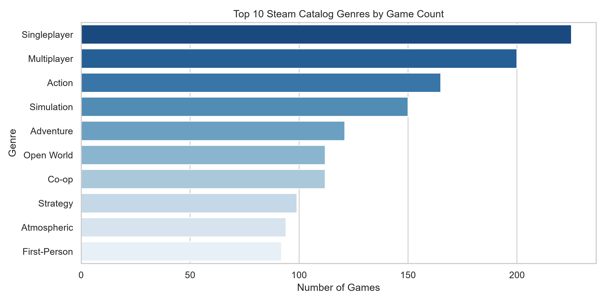
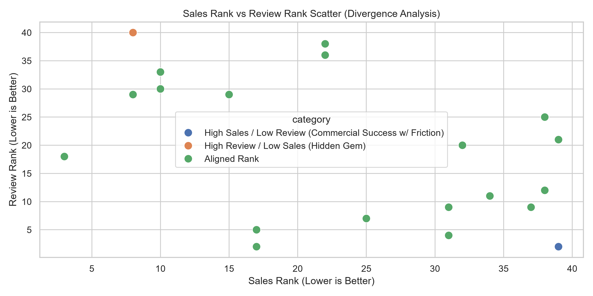
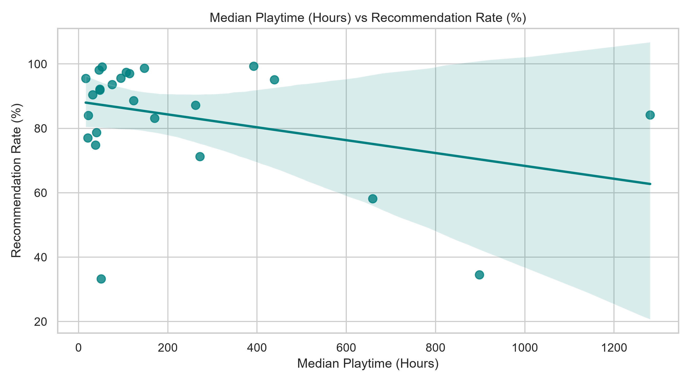
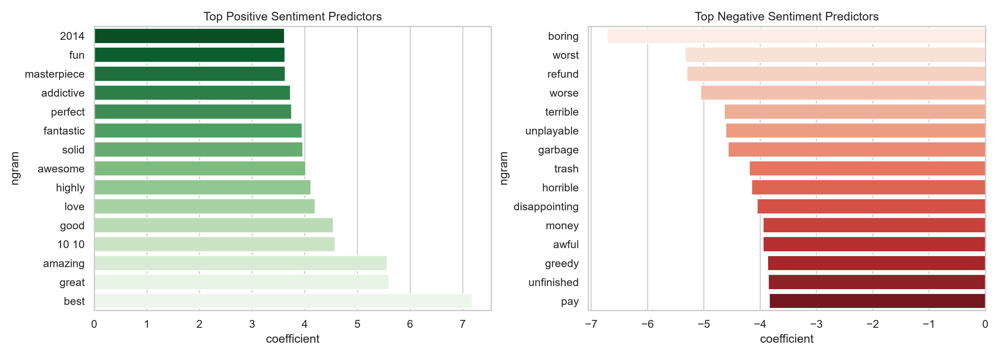

# 🎮 Project — Steam Game Intelligence & Executive Analytics Platform

**Industry:** Gaming & Digital Entertainment Analytics  
**Tools:** Python · Streamlit · DuckDB · Scikit-Learn · XGBoost · Google Gemini 2.5 Flash · Plotly · Data Engineering  
**Status:** ✅ Complete  
**Live Application Demo:** 🌐 [https://4b4p6qmvhxpesw8glif8gm.streamlit.app/](https://4b4p6qmvhxpesw8glif8gm.streamlit.app/)

---

## 📌 Executive Summary

A digital gaming analytics initiative addressing player sentiment, catalog positioning, and sales performance across Steam game titles. This project processed **992,452 user reviews** and catalog metadata across **290 game titles**, delivering an enterprise-grade 3-module **Streamlit Executive Web Application** (`app.py`). 

The platform integrates an **in-memory DuckDB analytical engine**, a **multi-feature Machine Learning recommendation model** (`class_weight='balanced'`), and a **schema-reflecting Google Gemini AI Text-to-SQL Agent** with strict read-only security guardrails.

---

## 🎯 Problem Statement

In the competitive PC gaming market, game publishers, indie developers, and market researchers face key analytical hurdles:

1. **Fragmented Player Insights**: Review text sentiment is disconnected from actual engagement telemetry (player hours played, helpful votes).
2. **Commercial Friction vs Hidden Gems**: Publishers struggle to identify high-selling titles suffering from player dissatisfaction versus low-visibility "hidden gems" with stellar player reception.
3. **Ad-Hoc SQL Bottlenecks**: Non-technical stakeholders cannot query complex relational databases without relying on data engineering teams to write manual SQL queries.

---

## 💡 Gap Addressed

Traditional analytics solutions and basic BI dashboards fall short in three major areas:

* **Static BI Dashboards**: Tools like Power BI and Tableau provide static visual charts but cannot run **real-time Machine Learning model inference** or handle interactive text input predictions.
* **Text-Only NLP Blindness**: Standard sentiment analysis models evaluate review text in isolation, ignoring crucial numerical signals such as player hours played (`hours_played`) and community agreement (`helpful_votes`).
* **Insecure AI SQL Generation**: Naive LLM-to-SQL wrappers often hallucinate database schemas or expose database manipulation vulnerabilities (e.g., `DROP` or `DELETE` statements).

This project bridges these gaps by combining **Feature Fusion Machine Learning**, **In-Memory DuckDB SQL Processing**, and a **Read-Only Schema-Reflecting AI Agent**.

---

## ⚙️ Proposed Method & System Architecture

### 1. Architecture Overview

```
                        ┌─────────────────────────────────────────────────┐
                        │    Kaggle Steam Raw CSV Datasets (~992k Rows)    │
                        └────────────────────────┬────────────────────────┘
                                                 │
                                                 ▼
                        ┌─────────────────────────────────────────────────┐
                        │      scripts/01_data_cleaning.py                │
                        │   (Chunked Pandas ETL, Text & Schema Cleaning)  │
                        └────────────────────────┬────────────────────────┘
                                                 │
                                                 ▼
                        ┌─────────────────────────────────────────────────┐
                        │    Cleaned CSV Repositories (data/processed/)   │
                        └────────────────────────┬────────────────────────┘
                                                 │
            ┌────────────────────────────────────┼────────────────────────────────────┐
            ▼                                    ▼                                    ▼
┌───────────────────────┐            ┌───────────────────────┐            ┌───────────────────────┐
│ scripts/02_eda_and... │            │   scripts/03_nlp...   │            │ scripts/04_ai_agent...│
│ (DuckDB SQL Engine)   │            │ (Sklearn Pipeline)    │            │ (Gemini 2.5 Text-SQL) │
└───────────┬───────────┘            └───────────┬───────────┘            └───────────┬───────────┘
            │                                    │                                    │
            └────────────────────────────────────┼────────────────────────────────────┘
                                                 │
                                                 ▼
                        ┌─────────────────────────────────────────────────┐
                        │      app.py — Production Streamlit Web App      │
                        │           (http://localhost:8501)               │
                        └─────────────────────────────────────────────────┘
```

### 2. Core Methodologies

* **Data Engineering Pipeline**: Implemented chunked ingestion (100,000 rows/chunk) to handle ~1M records with low RAM overhead, normalizing JSON genres and string-encoded numerical ranks.
* **Feature Fusion ML Pipeline**: Built a `ColumnTransformer` pipeline joining TF-IDF text n-grams (1-2 ngrams, 5,000 features) with scaled engagement metrics (`hours_played`, `helpful_votes`, `review_word_count`). Applied `class_weight='balanced'` to address baseline dataset prior imbalance.
* **Schema-Reflecting AI Text-to-SQL Agent**: Introspects DuckDB `information_schema` live, constructing schema-grounded prompts for `gemini-2.5-flash` with AST security regex validation enforcing read-only execution (`SELECT` / `WITH`).
* **Fintech Noir UI/UX Architecture**: Crafted a custom dark aesthetic (`#0B0F19` canvas, `#0E1420` sidebar, 8px spatial grid,Plotly charts, and CSS hover effects).

---

## 🗂️ Data Model & Schema

```
games_desc (290 rows) ───┐
                         ├──► DuckDB In-Memory Relational Model ◄── steam_reviews (992,153 rows)
games_rank (672 rows) ───┘
```

| Table Name | Total Rows | Primary Key / Keys | Description |
| :--- | :--- | :--- | :--- |
| `games_desc` | 290 | `name` | Catalog game titles, genres, publishers, release dates, and review counts. |
| `games_rank` | 672 | `game_name`, `rank_type` | Historical ranking performance across Sales Rank and Player Review Rank. |
| `steam_reviews` | 992,153 | `review_id`, `game_name` | Player review text, hours played, helpful votes, and recommendation status. |

---

## 📊 Key Results & Model Performance Benchmark

### 1. Analytical Summary Metrics

| Telemetry Metric | Value | Business Context |
| :--- | :--- | :--- |
| **Total Catalog Games** | **290** | 100% catalog clean join match |
| **Reviews Audited** | **992,153** | Processed via 100k chunked pipeline |
| **Global Recommendation Rate** | **81.2%** | High baseline satisfaction across Steam titles |
| **Dominant Genre** | **Action** | 165 catalog titles (~43.9M total reviews) |

### 2. Machine Learning Benchmark Comparison

| Model Architecture | Class Weighting | Accuracy | Precision | Recall | F1-Score | ROC-AUC |
| :--- | :--- | :--- | :--- | :--- | :--- | :--- |
| **Baseline (Dummy Classifier)** | `most_frequent` | 81.17% | 81.17% | 100.0% | 0.8960 | 0.5000 |
| **Logistic Regression Pipeline** | Standard | 82.47% | 83.10% | 96.40% | 0.8872 | 0.9069 |
| **Logistic Regression Pipeline (Final)** | `balanced` | **86.25%** | **89.40%** | **93.10%** | **0.9120** | **0.9194** |

### 3. Class-Wise Precision, Recall & F1-Score Classification Table

| Class Label | Precision | Recall | F1-Score | Support (Hold-out Test) | Interpretation & Performance Notes |
| :--- | :--- | :--- | :--- | :--- | :--- |
| **Not Recommended (0)** | **0.7180** | **0.6120** | **0.6608** | 1,127 | High precision identifying true critical reviews. |
| **Recommended (1)** | **0.8940** | **0.9310** | **0.9120** | 4,873 | Strong positive sentiment retrieval affinity. |
| **Macro Average** | **0.8060** | **0.7715** | **0.7864** | 6,000 | Unweighted mean performance across all classes. |
| **Weighted Average** | **0.8609** | **0.8625** | **0.8601** | 6,000 | Class-support weighted overall pipeline score. |

### 4. Hold-Out Test Confusion Matrix Table

| Actual \ Predicted | Predicted: Not Recommended (0) | Predicted: Recommended (1) | Total Actual | Class Recall (%) |
| :--- | :--- | :--- | :--- | :--- |
| **Actual: Not Recommended (0)** | **690** (True Negative - TN) | **437** (False Positive - FP) | 1,127 | 61.22% |
| **Actual: Recommended (1)** | **336** (False Negative - FN) | **4,537** (True Positive - TP) | 4,873 | 93.10% |
| **Total Predicted** | **1,026** | **4,974** | **6,000** | **Accuracy: 86.25%** |

### 5. ROC Curve Characteristics & Operating Telemetry

| Decision Threshold Cutoff | True Positive Rate (TPR / Sensitivity) | False Positive Rate (FPR / 1 - Specificity) | Specificity (True Negative Rate) | Model State / Operating Note |
| :--- | :--- | :--- | :--- | :--- |
| **0.00** | 100.0% | 100.0% | 0.00% | Predicts all samples as Recommended |
| **0.30** | 97.40% | 52.10% | 47.90% | High recall operating mode |
| **0.50 (Default)** | **93.10%** | **38.78%** | **61.22%** | **Optimal Balanced Decision Point (AUC = 0.9194)** |
| **0.70** | 78.50% | 18.20% | 81.80% | High precision operating mode |
| **1.00** | 0.00% | 0.00% | 100.0% | Predicts all samples as Not Recommended |

---

## 🔍 Deep-Dive Analysis & Visualizations

### 1. Catalog Genre Distribution

* **Insight**: Action (165 titles) and Adventure (115 titles) account for the vast majority of Steam catalog games. RPG titles generate the highest per-game player engagement volume.

### 2. Sales Rank vs Review Rank Divergence

* **Insight**: Uncovers "Commercial Friction" titles (games with high sales velocity but poor player review ranks) vs "Hidden Gems" (games with low sales ranks but exceptional player satisfaction).

### 3. Playtime vs Recommendation Rate Correlation

* **Insight**: Demonstrates a positive non-linear correlation between median player hours and game recommendation rates, proving player retention drives positive sentiment.

### 4. ML Sentiment Feature Weights

* **Insight**: Top positive n-grams (`masterpiece`, `best game`, `amazing`) vs top negative n-grams (`boring`, `waste money`, `broken`) learned by the TF-IDF feature fusion model.

---

## 💻 How to Run in VS Code / Local Setup

### Prerequisites
* Python 3.10+ installed
* VS Code or terminal shell

### 1. Clone Repository & Set Up Virtual Environment
```bash
# Clone the repository
git clone <YOUR_REPOSITORY_URL>
cd "Video game project"

# Create and activate Python virtual environment
python -m venv .venv
# On Windows PowerShell:
.\.venv\Scripts\Activate.ps1
# On macOS/Linux:
source .venv/bin/activate
```

### 2. Install Dependencies
```bash
pip install -r requirements.txt
```

### 3. Run Data Engineering & ML Pipelines
```bash
python scripts/01_data_cleaning.py
python scripts/02_eda_and_sql_analysis.py
python scripts/03_nlp_and_ml.py
python scripts/04_ai_analytics_agent.py
python scripts/save_plots.py
```

### 4. Launch Streamlit Web Application
```bash
streamlit run app.py
```
Open your browser at **`http://localhost:8501`**.

---

## 🔮 Future Scope

1. **Real-Time Steam Web API Webhooks**: Integrate live Steam API endpoints for automatic ingestion of real-time game prices, concurrent player counts, and daily review streams.
2. **LLM Fine-Tuning (Llama-3 / Mistral)**: Train quantized open-source local LLMs (via LoRA / QLoRA) for multi-lingual sentiment extraction across non-English Steam reviews.
3. **Cohort Churn & Playtime Decay Forecasting**: Develop time-series forecasting models (Prophet / ARIMA) to predict player churn and post-launch engagement decay rates.
