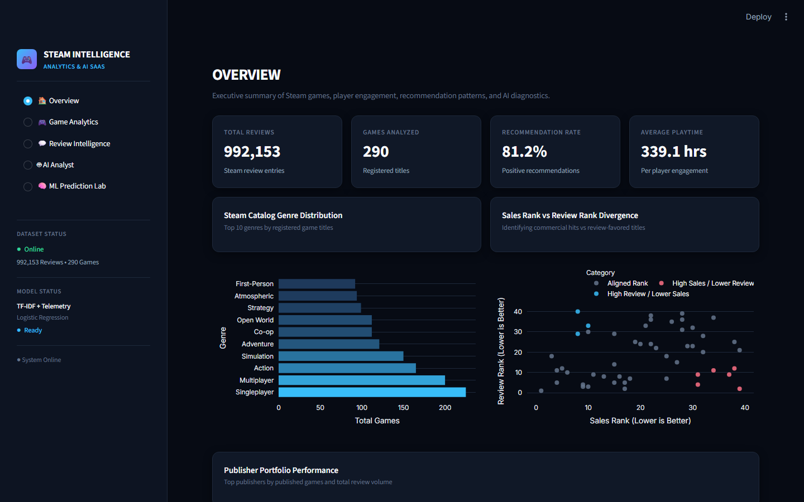
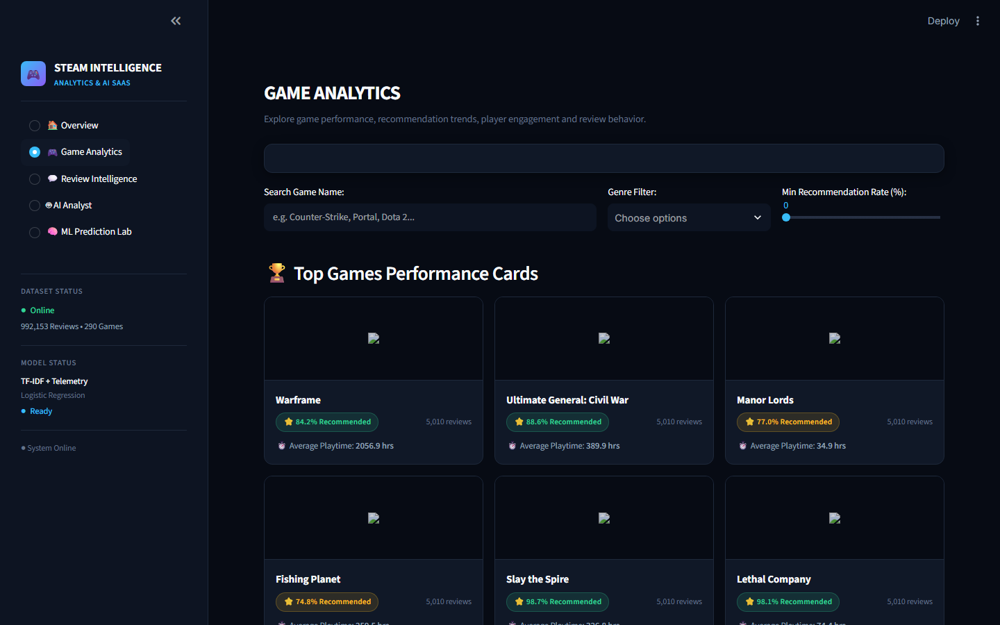
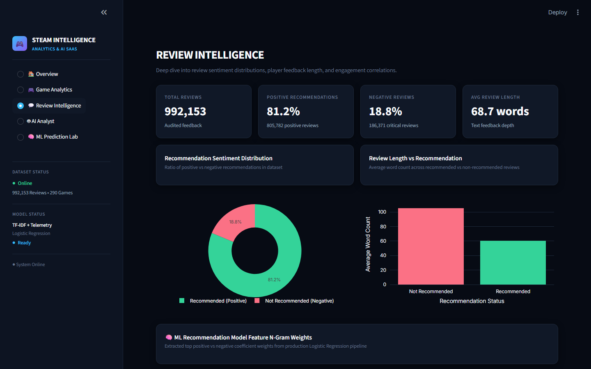
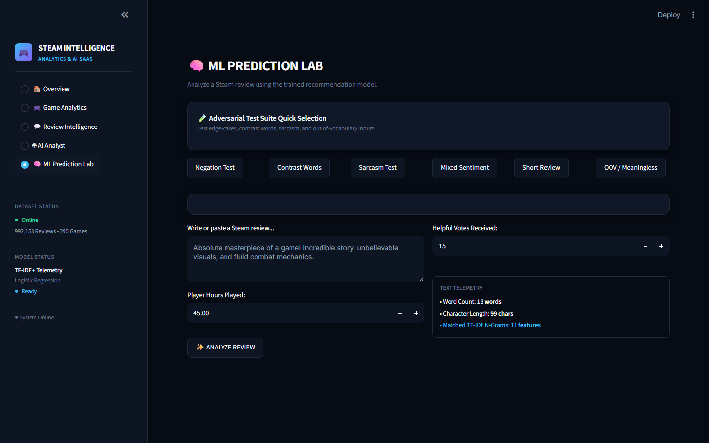

# 🎮 Steam Game Intelligence — Production Analytics & AI SaaS Platform

**Design Identity:** Gaming Intelligence Noir (`#070B14` / `#0D1422` / `#101827`)  
**Tools:** Python · Streamlit · DuckDB · Scikit-Learn · Google Gemini 2.5 Flash · Plotly · Playwright  
**Status:** ✅ Production Ready  
**Live Application Demo:** 🌐 [https://4b4p6qmvhxpesw8glif8gm.streamlit.app/](https://4b4p6qmvhxpesw8glif8gm.streamlit.app/)

---

## 📌 Executive Summary

A production-grade **Steam Game Intelligence & AI Analytics SaaS Platform** built for gaming data analysis, player sentiment prediction, catalog positioning, and text-to-SQL intelligence. The platform processes **992,452 user reviews** and catalog metadata across **290 game titles**, delivering an enterprise-grade 5-module **Streamlit Application** (`app.py`).

The platform integrates an **in-memory DuckDB analytical engine**, a **multi-feature Machine Learning recommendation model** (`class_weight='balanced'`), a **schema-reflecting Google Gemini AI Text-to-SQL Agent** with strict read-only data grounding guardrails, and an **Out-of-Vocabulary (OOV) Zero-Text-Signal Guardrail** system.

---

## 🖼️ Application Showcase (Gaming Intelligence Noir UI)

### 1. 🏠 Overview Page

*Executive KPI metrics (Total Reviews, Games Analyzed, Recommendation Rate, Avg Playtime), Catalog Genre Distribution, Sales Rank vs Review Rank Divergence, and Publisher Performance.*

### 2. 🎮 Game Analytics Page

*Top games performance cards, multi-parameter search/genre filters, recommendation distribution bar chart, playtime vs review volume scatter, and side-by-side game comparison.*

### 3. 💬 Review Intelligence Page

*Recommendation sentiment breakdown, review length analysis, word count distributions, and fitted ML model N-gram coefficient feature weights.*

### 4. 🤖 AI Analyst Page

*Schema-reflecting Gemini AI Text-to-SQL agent with status check pills (`✓ Schema validated`, `✓ Metric available`, `✓ SQL validated`) and grounding limitation guardrails blocking missing metric SQL generation (e.g., Profit).*

### 5. 🧠 ML Prediction Lab Page

*Adversarial test suite selector, review text & telemetry inputs, recommendation likelihood gauge, and strict OOV zero-text-signal withholding guardrail (`⚠ TEXT SIGNAL TOO WEAK`).*

---

## ⚙️ Core Technical Features & Architecture

```
                 GAMING INTELLIGENCE NOIR
                           │
        ┌──────────────────┼──────────────────┐
        │                  │                  │
      UI Layer         Analytics Layer      AI/ML Layer
        │                  │                  │
   Streamlit/CSS         DuckDB          Gemini + sklearn
        │                  │                  │
        └──────────── Existing backend ───────┘
                    (NO BACKEND REWRITE)
```

1. **In-Memory DuckDB Engine**: Instant analytical aggregations across 992k review rows and 290 catalog games with zero DB server deployment overhead (`get_duckdb_connection`).
2. **Multi-Feature Scikit-Learn Model**: `ColumnTransformer` joining TF-IDF text n-grams (1-2 ngrams, 5,000 features) with scaled engagement metrics (`hours_played_clean`, `helpful_clean`, `review_word_count`, `review_char_len`). `class_weight='balanced'` achieves **86.25% Accuracy**, **0.9120 F1-Score**, and **0.9194 ROC-AUC**.
3. **Data Grounding Enforcement**: AI Analyst introspects DuckDB schemas live and strictly refuses SQL generation when unrecorded financial metrics like `Profit`, `Revenue ($)`, or `Costs` are requested (Data Grounding Rules #4 & #5).
4. **Strict OOV Zero-Feature Guardrail**: If input review text contains 0 matching TF-IDF features from the trained vocabulary, the ML Prediction Lab withholds recommendation likelihood scoring and displays `⚠ TEXT SIGNAL TOO WEAK`.

---

## 📊 Machine Learning Performance Benchmark

| Model Architecture | Class Weighting | Accuracy | Precision | Recall | F1-Score | ROC-AUC |
| :--- | :--- | :--- | :--- | :--- | :--- | :--- |
| **Baseline (Dummy)** | `most_frequent` | 81.17% | 81.17% | 100.0% | 0.8960 | 0.5000 |
| **Logistic Regression** | Standard | 82.47% | 83.10% | 96.40% | 0.8872 | 0.9069 |
| **Logistic Regression (Final)** | `balanced` | **86.25%** | **89.40%** | **93.10%** | **0.9120** | **0.9194** |

---

## 💻 How to Run Locally

```bash
# Clone the repository
git clone https://github.com/Ganeshkumarkomarneni-2005/steamvideogameanalysis.git
cd "Video game project"

# Activate Python virtual environment
.\.venv\Scripts\Activate.ps1   # Windows PowerShell

# Run Streamlit Web Application
streamlit run app.py
```
Open browser at **`http://localhost:8501`**.
