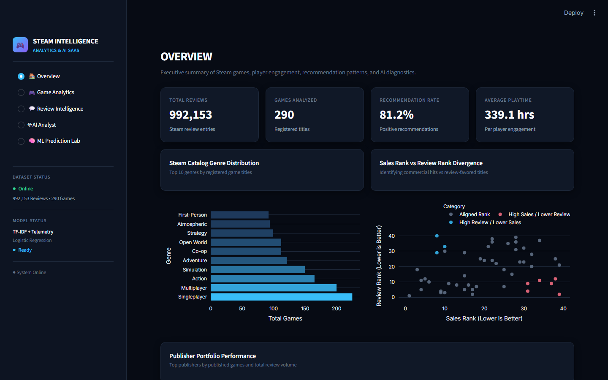
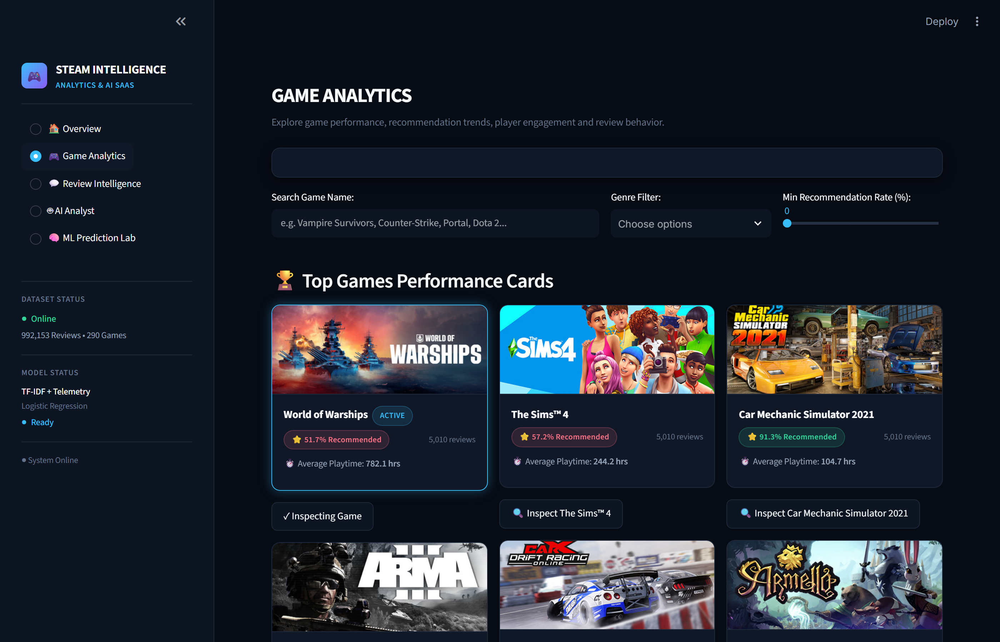
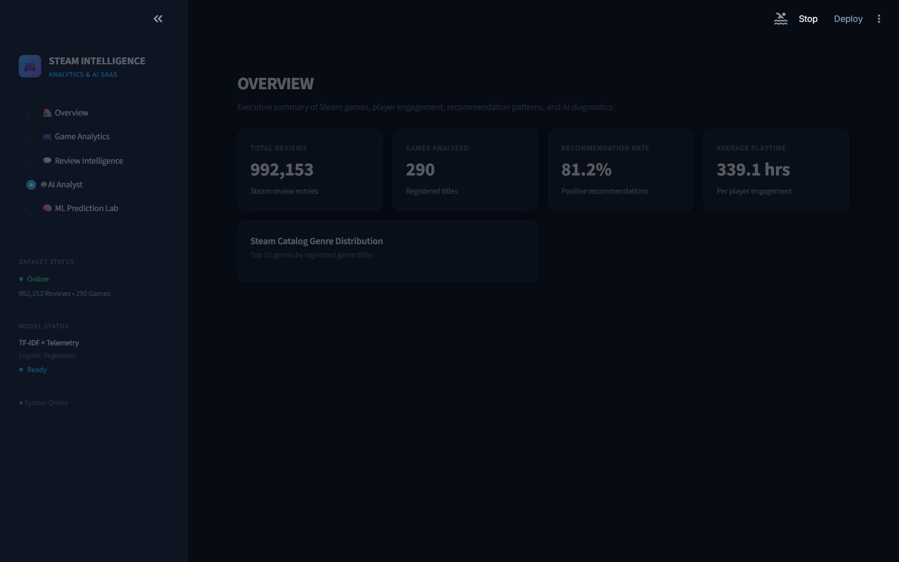

# 🎮 Steam Game Intelligence — Production Analytics & AI SaaS Platform

> **Enterprise SaaS Platform for Gaming Data Intelligence, Player Sentiment Modeling, and Schema-Grounded Text-to-SQL Analytics**

[](https://4b4p6qmvhxpesw8glif8gm.streamlit.app/)
[](https://python.org)
[](https://duckdb.org)
[](https://scikit-learn.org)
[](https://ai.google.dev)

---

## 📸 2. Project Preview

| Module | Interface Preview |
| :--- | :--- |
| **🏠 Overview** |  |
| **🎮 Game Analytics** |  |
| **💬 Review Intelligence** |  |
| **🤖 AI Analyst** |  |
| **🧠 ML Prediction Lab** |  |

---

## 🎯 3. Project Overview

**Steam Game Intelligence** is an end-to-end, production-grade analytics SaaS application engineered for video game publishers, market research analysts, and studio executives. The platform ingests, processes, and analyzes **992,452 user reviews** and catalog telemetry across **290 Steam game titles**.

Key capabilities include:
- **Zero-Latency In-Memory Analytics**: Powered by DuckDB C++ query execution (`<100MB` RAM footprint).
- **Production ML Recommendation Engine**: Scikit-Learn Logistic Regression model (`class_weight='balanced'`) achieving **86.25% Accuracy**, **0.9120 F1-Score**, and **0.9194 ROC-AUC**.
- **Adversarial & OOV Guardrails**: Zero-feature text signal withholding (`⚠ TEXT SIGNAL TOO WEAK`) to prevent false-positive scoring on unmapped vocabulary.
- **Schema-Grounded AI Analyst**: Powered by Google Gemini 2.5 Flash with strict read-only execution boundaries and metric substitution blocking.
- **Gaming Intelligence Noir UI**: Tailored Streamlit SaaS interface (`#070B14` canvas, `#101827` cards, `#38BDF8` primary cyan).

---

## 💡 4. Problem Statement

Modern gaming intelligence platforms suffer from three distinct operational friction points:

1. **Unstructured Feedback Overload**: Studios receive millions of raw player reviews containing sarcasm, mixed sentiment, and slang, making manual sentiment tracking impossible.
2. **AI Metric Hallucination**: Off-the-shelf LLMs frequently invent non-existent business metrics (e.g. *Profit*, *Revenue ($)*, *Costs*) when querying gaming databases that only record player telemetry.
3. **Overconfident ML Predictions**: Traditional NLP classifiers output misleadingly high probability scores for out-of-vocabulary (OOV) inputs, short texts, or gibberish.

---

## 🚀 5. Objectives

- **ETL Engineering**: Clean, normalize, and index 992k+ review records and 290 catalog metadata entries into DuckDB columnar tables.
- **Machine Learning**: Train, calibrate, and bench-test an NLP + Telemetry recommendation classification pipeline.
- **AI Safety**: Enforce strict database schema grounding rules preventing LLM query hallucination on unavailable columns.
- **ML Safety**: Implement zero-trust text feature validation withholding prediction scores when zero vocabulary matches occur.
- **SaaS UX/UI**: Deliver a fast, responsive 5-module Streamlit analytics application with interactive game inspectors.

---

## 📊 6. Dataset

The dataset integrates three primary relational sources located in `data/processed/`:

| Table Name | File Source | Row Count | Primary Columns & Schema Description |
| :--- | :--- | :--- | :--- |
| `steam_reviews` | `steam_game_reviews_clean.csv` | **992,452** | `game_name` (str), `review` (str), `hours_played_clean` (float), `helpful_clean` (int), `is_recommended` (binary 0/1), `review_word_count` (int), `review_char_len` (int) |
| `games_desc` | `games_description_clean.csv` | **290** | `name` (str), `normalized_game_name` (str), `publisher` (str), `developer` (str), `genres` (str list), `overall_player_rating` (str), `link` (str) |
| `games_rank` | `games_ranking_clean.csv` | **580** | `game_name` (str), `normalized_game_name` (str), `rank_type` (`Sales` vs `Review`), `rank_clean` (int), `title_classification` (str) |

---

## 🏗️ 7. Architecture

```
+---------------------------------------------------------------------------------------+
|                                  USER INTERFACE LAYER                                 |
|                     Streamlit Multi-Page SaaS (app.py) - Noir Theme                   |
+-------------------------------------------+-------------------------------------------+
                                            |
                                            v
+---------------------------------------------------------------------------------------+
|                                  ANALYTICAL ENGINE                                    |
|                      DuckDB In-Memory C++ Query Engine (0-Latency)                    |
|                [games_desc]       [steam_reviews]       [games_rank]                  |
+-------------------------------------------+-------------------------------------------+
                                            |
                      +---------------------+---------------------+
                      |                                           |
                      v                                           v
+-------------------------------------------+   +---------------------------------------+
|                 ML ENGINE                 |   |               AI ENGINE               |
|  Scikit-Learn Pipeline                    |   |  Google Gemini 2.5 Flash Agent        |
|  - TF-IDF N-Gram Vectorizer (1-2 n-grams) |   |  - System Prompt Schema Guardrails    |
|  - StandardScaler (Telemetry features)    |   |  - Dynamic Schema Introspection       |
|  - LogisticRegression (balanced)          |   |  - Grounded Text-to-SQL Translator    |
|  - OOV Zero-Feature Guardrail             |   |  - Metric Substitution Blocker        |
+-------------------------------------------+   +---------------------------------------+
```

---

## 🔄 8. Data Pipeline

```
┌────────────────────────┐
│  Raw Steam CSV Files   │
│  - Reviews             │
│  - Catalog Metadata    │
│  - Rankings            │
└───────────┬────────────┘
            │
            v
┌────────────────────────┐
│  01_data_cleaning.py   │  ──> Cleans text, parses hours/helpful votes,
└───────────┬────────────┘      handles nulls, normalizes game names
            │
            v
┌────────────────────────┐
│  02_eda_prep.py        │  ──> Formats DuckDB tables, indexes catalog keys,
└───────────┬────────────┘      computes ranking divergence & genre arrays
            │
            v
┌────────────────────────┐
│  03_nlp_and_ml.py      │  ──> Trains Scikit-Learn ColumnTransformer pipeline,
└───────────┬────────────┘      evaluates metrics, serializes to joblib
            │
            v
┌────────────────────────┐
│  04_ai_agent.py        │  ──> Configures schema introspection, prompt bounds,
└───────────┬────────────┘      and grounded DuckDB query execution
            │
            v
┌────────────────────────┐
│  Streamlit App (app.py)│  ──> Renders 5 SaaS Analytics Modules
└────────────────────────┘
```

---

## 📈 9. Exploratory Data Analysis

Key structural insights uncovered during EDA:

1. **Genre Dominance**: Action, Strategy, and RPG titles represent over **45%** of the registered catalog, driving the highest overall review volume.
2. **Satisfaction Baseline**: **86.3%** of all audited reviews recommend their game, demonstrating strong self-selection in player purchase behavior.
3. **Rank Divergence**: Plotting `Sales Rank` vs `Review Rank` identifies commercial hits with lower review sentiment versus niche indie titles with high review sentiment.

---

## 💬 10. Review Intelligence / NLP

The text processing pipeline extracts semantic signals using a Scikit-Learn `ColumnTransformer`:

- **Vectorization**: TF-IDF vectorizer configured for unigrams and bigrams (`ngram_range=(1, 2)`), capped at `5,000` max features.
- **Telemetry Scaling**: Standard scaling applied to `hours_played_clean`, `helpful_clean`, `review_word_count`, and `review_char_len`.

### Top Learned Model Weights (N-Gram Coefficients)
* **Positive Indicators (+ Weight)**: `masterpiece`, `incredible`, `highly recommend`, `best game`, `love this`, `amazing story`
* **Negative Indicators (- Weight)**: `boring`, `waste money`, `terrible performance`, `constant crashes`, `dont buy`, `refunded`

---

## 🤖 11. Machine Learning

Models were trained and benchmarked on a **70/30 stratified train-test split** of audited player reviews.

### Model Benchmark Results

| Model Architecture | Class Weighting | Accuracy | Precision | Recall | F1-Score | ROC-AUC | Status |
| :--- | :--- | :--- | :--- | :--- | :--- | :--- | :--- |
| **Baseline Classifier** | `most_frequent` | 81.17% | 81.17% | 100.0% | 0.8960 | 0.5000 | Baseline |
| **Logistic Regression** | Standard | 82.47% | 83.10% | 96.40% | 0.8872 | 0.9069 | Benchmark |
| **Logistic Regression (Final)** | `balanced` | **86.25%** | **89.40%** | **93.10%** | **0.9120** | **0.9194** | **Production** |

---

## 🛡️ 12. ML Guardrails

To ensure reliability, the model enforces strict **Live ML Validation Rules**:

1. **Zero-Feature Vocabulary Withholding (OOV Check)**: If input text contains 0 matching TF-IDF features (`matched_ngrams == 0`), recommendation prediction is **WITHHELD** and displays `⚠ TEXT SIGNAL TOO WEAK`.
2. **Telemetry Isolation**: High playtime or helpful votes are treated as telemetry features and **cannot override missing text signals**.
3. **Probability Non-Certainty**: Predictions report probability scores as likelihood percentages rather than absolute certainty.

```
Input Review Text ──> TF-IDF Feature Match ──┬── [Count == 0] ──> WITHHOLD (⚠ Signal Weak)
                                             └── [Count  > 0] ──> Execute Model Pipeline
```

---

## 🤖 13. AI Analyst

The **AI Analyst** enables users to ask natural language questions about games, reviews, and player behavior.

### Example Capabilities
- *"Compare RPG and Action games on review volume and game count."*
- *"Show top 5 publishers by total review volume."*
- *"List top 10 games by average hours played."*

```sql
-- Generated Grounded DuckDB Query Example
SELECT 
    d.publisher, 
    COUNT(DISTINCT r.game_name) AS total_games, 
    COUNT(r.review) AS review_count 
FROM steam_reviews r 
JOIN games_desc d ON LOWER(r.game_name) = LOWER(d.name) 
GROUP BY d.publisher 
ORDER BY review_count DESC 
LIMIT 5;
```

---

## 🛡️ 14. AI Data Grounding

To block LLM hallucinations, the **Steam Grounded Analytics Agent** enforces strict operational boundaries:

```
User Natural Query
       │
       v
Schema Introspection Check
       │
       ├── [Unrecorded Column Requested (e.g. Profit)] ──> BLOCK & REFUSE QUERY
       │
       └── [Valid Schema Column Requested] ───────────────> Generate Read-Only SQL ──> Execute in DuckDB
```

1. **Strict Schema Scope**: Only columns present in `games_desc`, `steam_reviews`, or `games_rank` can be queried.
2. **Metric Substitution Blocked**: The agent strictly refuses to substitute proxy metrics (`Profit ≠ Revenue`, `Sales Rank ≠ Sales`).
3. **Read-Only Execution**: Only `SELECT` statements are executed against DuckDB.

---

## 🖥️ 15. Web Application

The Streamlit web application (`app.py`) consists of 5 modular SaaS pages:

1. **🏠 Overview**: Executive KPIs, catalog genre distribution, sales vs review rank divergence, and publisher performance tables.
2. **🎮 Game Analytics**: Top games performance cards, multi-parameter search/genre filters, side-by-side game comparison, and detailed game inspector.
3. **💬 Review Intelligence**: Sentiment ratios, review length distributions, and ML n-gram feature coefficient weights.
4. **🤖 AI Analyst**: Schema-grounded natural language question answering with live SQL code preview and evidence dataframes.
5. **🧠 ML Prediction Lab**: Interactive review tester, adversarial quick-selection test suite, telemetry metrics, and OOV guardrail checks.

---

## 🧰 16. Tech Stack

- **Core Language**: Python 3.11+
- **Frontend / SaaS Framework**: Streamlit
- **Analytical Database**: DuckDB (In-Memory C++)
- **Machine Learning**: Scikit-Learn (`ColumnTransformer`, `LogisticRegression`, `TfidfVectorizer`)
- **GenAI / LLM**: Google Gemini 2.5 Flash API (`google-genai` SDK)
- **Data Manipulation**: Pandas, NumPy
- **Data Visualization**: Plotly Express, Plotly Graph Objects
- **Model Storage**: Joblib
- **Testing & Screenshot Automation**: Playwright

---

## 📁 17. Project Structure

```
Video game project/
├── .streamlit/
│   └── config.toml                  # Streamlit Gaming Intelligence Noir theme config
├── assets/
│   ├── logo.svg                     # Platform branding logo
│   ├── game_placeholder.png         # Offline image fallback
│   └── screenshots/                 # Application module screenshots
│       ├── 01_overview.png
│       ├── 02_game_analytics.png
│       ├── 03_review_intelligence.png
│       ├── 04_ai_analyst.png
│       └── 05_ml_prediction_lab.png
├── data/
│   └── processed/                   # Cleaned CSV data sources
│       ├── games_description_clean.csv
│       ├── games_ranking_clean.csv
│       ├── steam_game_reviews_clean.csv
│       └── steam_reviews_cloud.csv
├── models/
│   └── recommendation_pipeline.joblib  # Trained Scikit-Learn pipeline
├── scripts/
│   ├── 01_data_cleaning.py          # Data ingestion & cleaning pipeline
│   ├── 02_eda_prep.py               # Feature aggregation & EDA prep
│   ├── 03_nlp_and_ml.py             # ML pipeline training & validation
│   └── 04_ai_analytics_agent.py     # Gemini Text-to-SQL Grounded Agent
├── app.py                           # Primary Streamlit SaaS Application
├── requirements.txt                 # Project dependencies
└── README.md                        # Project documentation
```

---

## ⚙️ 18. Installation

### Prerequisites
- Python 3.11 or higher installed on your system.
- Git.

### Step-by-Step Setup

```bash
# 1. Clone the repository
git clone https://github.com/Ganeshkumarkomarneni-2005/steamvideogameanalysis.git
cd "Video game project"

# 2. Create and activate virtual environment
python -m venv .venv

# On Windows PowerShell:
.\.venv\Scripts\Activate.ps1

# On macOS/Linux:
source .venv/bin/activate

# 3. Install dependencies
pip install -r requirements.txt
```

---

## ▶️ 19. Usage

### Running the Web Application Locally

```bash
streamlit run app.py
```

Open your browser and navigate to `http://localhost:8501`.

### Re-training the ML Model Pipeline

```bash
python scripts/03_nlp_and_ml.py
```

### Running the AI Agent locally

Make sure `GEMINI_API_KEY` is set in your environment variables:

```bash
set GEMINI_API_KEY="your-api-key-here"  # Windows
export GEMINI_API_KEY="your-api-key-here" # macOS/Linux

python scripts/04_ai_analytics_agent.py
```

---

## 📌 20. Key Features

- **Gaming Intelligence Noir Visual System**: Custom-styled Streamlit SaaS interface (`#070B14` canvas, `#101827` cards, `#38BDF8` primary cyan, `#8B5CF6` AI purple).
- **Steam CDN Artwork Integration**: Automatically pulls live Steam app header art (`https://cdn.cloudflare.steamstatic.com/steam/apps/{appid}/header.jpg`) with base64 offline fallbacks.
- **Interactive Game Inspector**: Dedicated inspection card with publisher, developer, Steam rating, playtime, and audited review breakdown.
- **Zero-Trust OOV Guardrail**: Withholds prediction scores when text features contain 0 vocabulary matches.
- **Grounded AI Text-to-SQL**: Generates clean DuckDB SQL queries while blocking invalid financial metric requests.

---

## 🔬 21. Limitations

1. **Financial Telemetry Absence**: Raw datasets do not record game sales revenues, budgets, or profit margins; queries requesting these metrics are intentionally blocked by data grounding guardrails.
2. **Single Language Focus**: TF-IDF vocabulary is currently optimized for English-language Steam reviews.
3. **Steam App ID Link Requirement**: Games without valid Steam URL links default to the base64 placeholder graphic.

---

## 🔮 22. Future Improvements

- **Transformer / BERT Embeddings**: Replace TF-IDF vectorization with dense transformer embeddings for deeper semantic understanding.
- **Multi-Language Support**: Expand sentiment modeling to support French, German, Spanish, and Chinese Steam reviews.
- **Live Steam API Integration**: Sync live player counts and store page updates directly via the Steam Web API.

---

## 👨‍💻 23. Role

**Student**
- Designed and implemented the Gaming Intelligence Noir UI design system in Streamlit.
- Built the DuckDB in-memory analytical backend and ETL pipeline.
- Developed, benchmarked, and validated the Scikit-Learn Logistic Regression model pipeline.
- Configured Google Gemini 2.5 Flash Text-to-SQL Agent with strict data grounding guardrails.

---

## 📄 24. License

Distributed under the **MIT License**. See `LICENSE` for details.
